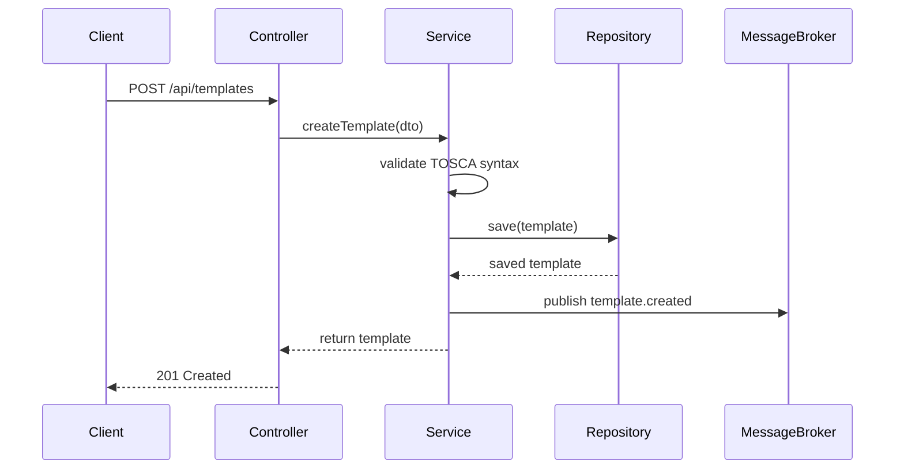

# Key Flows: {{SERVICE_NAME}}

## Metadata
```yaml
source: SEMI
completeness: {{COMPLETE|PARTIAL|MISSING}}
needs-human: {{true|false}}
risk: {{MEDIUM|HIGH|LOW}}
last-updated: {{TIMESTAMP}}
```

## Overview
{{DOCUMENT_3_5_CRITICAL_OPERATIONAL_FLOWS}}

This section documents the most important operational sequences that:
- Represent critical business operations
- Involve multiple components or services
- Have complex decision logic
- Are error-prone or require careful handling

> ⚠️ **Needs Review**: Verify completeness of flows and add business context where needed.

---

## Flow 1: {{FLOW_NAME_1}}

### Trigger
{{WHAT_INITIATES_THIS_FLOW}}
- **Endpoint**: {{POST /api/templates}}
- **Event**: {{template.create.requested}}
- **Scheduled**: {{CRON_EXPRESSION}}

### Actors
- **User/Client**: {{WHO_INITIATES}}
- **Services**: {{SERVICES_INVOLVED}}
- **External Systems**: {{IF_ANY}}

### Preconditions
{{WHAT_MUST_BE_TRUE_BEFORE_FLOW_STARTS}}
- User is authenticated
- Request payload is valid
- System is in ready state

### Flow Steps



**Detailed Steps**:

1. **Request Validation** (Controller)
   - Validate request body structure
   - Check authentication/authorization
   - Extract DTO

2. **Business Validation** (Service)
   - Check for duplicate (name + version)
   - Validate TOSCA syntax using parser library
   - Apply business rules

3. **Persistence** (Repository)
   - Set metadata (createdAt, createdBy)
   - Set initial state (DRAFT)
   - Save to database

4. **Event Publication** (Service)
   - Create TemplateCreatedEvent
   - Publish to message broker
   - Log event

5. **Response** (Controller)
   - Map entity to DTO
   - Return 201 Created with Location header

### Decision Points
{{KEY_BRANCHING_LOGIC}}

- **If duplicate exists**: Return 409 Conflict
- **If TOSCA invalid**: Return 400 Bad Request with validation errors
- **If database error**: Return 500 Internal Server Error

### Error Scenarios
{{WHAT_CAN_GO_WRONG}}

| Error | Cause | HTTP Status | Recovery |
|-------|-------|-------------|----------|
| {{Duplicate template}} | {{Name+version exists}} | {{409}} | {{User changes name/version}} |
| {{Invalid TOSCA}} | {{Syntax error}} | {{400}} | {{User fixes YAML}} |
| {{DB connection failed}} | {{MongoDB down}} | {{500}} | {{Retry, alert ops}} |

### Postconditions
{{WHAT_IS_TRUE_AFTER_SUCCESS}}
- Template exists in database with DRAFT state
- TemplateCreatedEvent published
- Audit log entry created

### Performance Considerations
- **Expected Duration**: {{< 500ms}}
- **Bottlenecks**: {{TOSCA parsing can take 200-300ms}}
- **Optimization**: {{Cache parsed schemas}}

---

## Flow 2: {{FLOW_NAME_2}}

### Trigger
{{WHAT_INITIATES_THIS_FLOW}}

### Actors
{{WHO_IS_INVOLVED}}

### Flow Steps
{{SEQUENCE_OF_OPERATIONS}}

1. **Step 1**: {{DESCRIPTION}}
2. **Step 2**: {{DESCRIPTION}}
3. **Step 3**: {{DESCRIPTION}}

### Decision Points
{{BRANCHING_LOGIC}}

### Error Scenarios
{{ERROR_HANDLING}}

---

## Flow 3: {{FLOW_NAME_3}}

### Trigger
{{WHAT_INITIATES_THIS_FLOW}}

### Actors
{{WHO_IS_INVOLVED}}

### Flow Steps
{{SEQUENCE_OF_OPERATIONS}}

1. **Step 1**: {{DESCRIPTION}}
2. **Step 2**: {{DESCRIPTION}}
3. **Step 3**: {{DESCRIPTION}}

### Decision Points
{{BRANCHING_LOGIC}}

### Error Scenarios
{{ERROR_HANDLING}}

---

## Cross-Cutting Concerns

### Transaction Management
{{HOW_TRANSACTIONS_ARE_HANDLED}}
- **Scope**: {{METHOD_LEVEL|CLASS_LEVEL}}
- **Propagation**: {{REQUIRED|REQUIRES_NEW}}
- **Rollback**: {{ON_EXCEPTION}}

### Retry Logic
{{IF_RETRY_MECHANISMS_EXIST}}
- **Retryable Operations**: {{EXTERNAL_API_CALLS|MESSAGE_PUBLISHING}}
- **Max Retries**: {{3}}
- **Backoff Strategy**: {{EXPONENTIAL}}

### Async Processing
{{IF_ASYNC_OPERATIONS_EXIST}}
- **Async Methods**: {{@Async_ANNOTATED_METHODS}}
- **Thread Pool**: {{CONFIGURATION}}
- **Error Handling**: {{ASYNC_EXCEPTION_HANDLER}}

### Caching
{{IF_CACHING_IS_USED}}
- **Cached Operations**: {{FREQUENTLY_READ_DATA}}
- **Cache Provider**: {{Redis|Caffeine}}
- **TTL**: {{EXPIRATION_TIME}}
- **Eviction**: {{WHEN_DATA_CHANGES}}

---
*Auto-generated by /architecture-intake workflow*
